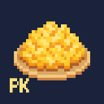

# PK Scramble Eggs


A cool way to scramble strings :)

## CLI Tool for Date-Based Character Shifting

This CLI tool takes a date, transforms it into a float in the format `0.MONTH-DAY-YEAR`, and uses a natural constant (such as π) to perform character shifting on a given string. This can be used to encode secrets in plain text.

This is just a cipher without a ciphering table it's ciphering by digits of a natural or "custom" constant.

## Features

- Accepts a date input.
- Converts the date to a float in the format `0.MONTH-DAY-YEAR`.
- Divides a natural constant you choose by the date float.
- Stores all digits up to a specified length.
- Uses the digits to shift characters in a string.
- this will be used to hide things in plain sight. ( only the person who knows it will be able to decode.)

## Usage

```sh
# Example usage
#  -d, --date string    A date flag (MM-DD-YYYY) (default "01-03-2009")
#  -s, --string string  A string flag (default "default")
#  -i, --constant int   An integer flag (0-5)
go run cmd/main.go --date 10-05-2023 --constant 1 --string "HelloWorld"
# or use the binary
# make build to create it
./pk_scrambled_eggs --date 10-05-2023 --constant 1 --string "HelloWorld"
```

## Example

Given the date `10-05-2023`:
1. Convert to float: `0.10-05-2023`
2. Divide π by the float value.
3. Extract digits up to the specified length.
4. Shift characters in the string "HelloWorld" using the extracted digits.

If you send date as `00-00-0000`, it won't do the float division//multiplication it will be just the natural constant.

## Example output:

``` bash
# creating
➜ go run cmd/main.go  --date 01-01-0000 
Integer: 0 => PI - π 
String: default
Date: 01-01-0000
CustomConstant: 3.141592653613770380616188049 / 0.010100000000000000000000000 = 311.048777386693671198174504950
Custom constant[31]: 311.048777386693671198174504950

Scramble -> d -> : g , 100 + 3 = 103 
Scramble -> e -> : f , 101 + 1 = 102 
Scramble -> f -> : g , 102 + 1 = 103 
Scramble -> a -> : a , 097 + 0 = 97 
Scramble -> u -> : y , 117 + 4 = 121 
Scramble -> l -> : t , 108 + 8 = 116 
Scramble -> t -> : { , 116 + 7 = 123 
Scrambled string "default" to "gfgayt{"

Unscramble -> d -> : a , 100 - 3 = 97 
Unscramble -> e -> : d , 101 - 1 = 100 
Unscramble -> f -> : e , 102 - 1 = 101 
Unscramble -> a -> : a , 097 - 0 = 97 
Unscramble -> u -> : q , 117 - 4 = 113 
Unscramble -> l -> : d , 108 - 8 = 100 
Unscramble -> t -> : m , 116 - 7 = 109 
Unscrambled string "default" to "adeaqdm"

# reverting
➜ go run cmd/main.go  --date 01-01-0000 --string gfgayt{
Integer: 0 => PI - π 
String: gfgayt{
Date: 01-01-0000
CustomConstant: 3.141592653613770380616188049 / 0.010100000000000000000000000 = 311.048777386693671198174504950
Custom constant[31]: 311.048777386693671198174504950

Scramble -> g -> : j , 103 + 3 = 106 
Scramble -> f -> : g , 102 + 1 = 103 
Scramble -> g -> : h , 103 + 1 = 104 
Scramble -> a -> : a , 097 + 0 = 97 
Scramble -> y -> : } , 121 + 4 = 125 
Scramble -> t -> : | , 116 + 8 = 124 
Scramble -> { -> : ‚ , 123 + 7 = 130 
Scrambled string "gfgayt{" to "jgha}|‚"

Unscramble -> g -> : d , 103 - 3 = 100 
Unscramble -> f -> : e , 102 - 1 = 101 
Unscramble -> g -> : f , 103 - 1 = 102 
Unscramble -> a -> : a , 097 - 0 = 97 
Unscramble -> y -> : u , 121 - 4 = 117 
Unscramble -> t -> : l , 116 - 8 = 108 
Unscramble -> { -> : t , 123 - 7 = 116 
Unscrambled string "gfgayt{" to "default"

# with a custom date
➜ go run cmd/main.go  --date 04-07-2025           
Integer: 0 => PI - π 
String: default
Date: 04-07-2025
CustomConstant: 3.141592653613770380616188049 / 0.040720250000000000000000000 = 77.150622886784979932627194086
Custom constant[30]: 77.150622886784979932627194086

Scramble -> d -> : k , 100 + 7 = 107 
Scramble -> e -> : l , 101 + 7 = 108 
Scramble -> f -> : g , 102 + 1 = 103 
Scramble -> a -> : f , 097 + 5 = 102 
Scramble -> u -> : u , 117 + 0 = 117 
Scramble -> l -> : r , 108 + 6 = 114 
Scramble -> t -> : v , 116 + 2 = 118 
Scrambled string "default" to "klgfurv"

Unscramble -> d -> : ] , 100 - 7 = 93 
Unscramble -> e -> : ^ , 101 - 7 = 94 
Unscramble -> f -> : e , 102 - 1 = 101 
Unscramble -> a -> : \ , 097 - 5 = 92 
Unscramble -> u -> : u , 117 - 0 = 117 
Unscramble -> l -> : f , 108 - 6 = 102 
Unscramble -> t -> : r , 116 - 2 = 114 
Unscrambled string "default" to "]^e\ufr"

➜  go run cmd/main.go  --date 04-07-2025 --string klgfurv
Integer: 0 => PI - π 
String: klgfurv
Date: 04-07-2025
CustomConstant: 3.141592653613770380616188049 / 0.040720250000000000000000000 = 77.150622886784979932627194086
Custom constant[30]: 77.150622886784979932627194086

Scramble -> k -> : r , 107 + 7 = 114 
Scramble -> l -> : s , 108 + 7 = 115 
Scramble -> g -> : h , 103 + 1 = 104 
Scramble -> f -> : k , 102 + 5 = 107 
Scramble -> u -> : u , 117 + 0 = 117 
Scramble -> r -> : x , 114 + 6 = 120 
Scramble -> v -> : x , 118 + 2 = 120 
Scrambled string "klgfurv" to "rshkuxx"

Unscramble -> k -> : d , 107 - 7 = 100 
Unscramble -> l -> : e , 108 - 7 = 101 
Unscramble -> g -> : f , 103 - 1 = 102 
Unscramble -> f -> : a , 102 - 5 = 97 
Unscramble -> u -> : u , 117 - 0 = 117 
Unscramble -> r -> : l , 114 - 6 = 108 
Unscramble -> v -> : t , 118 - 2 = 116 
Unscrambled string "klgfurv" to "default"
```

## License

This project is licensed under whatever License.